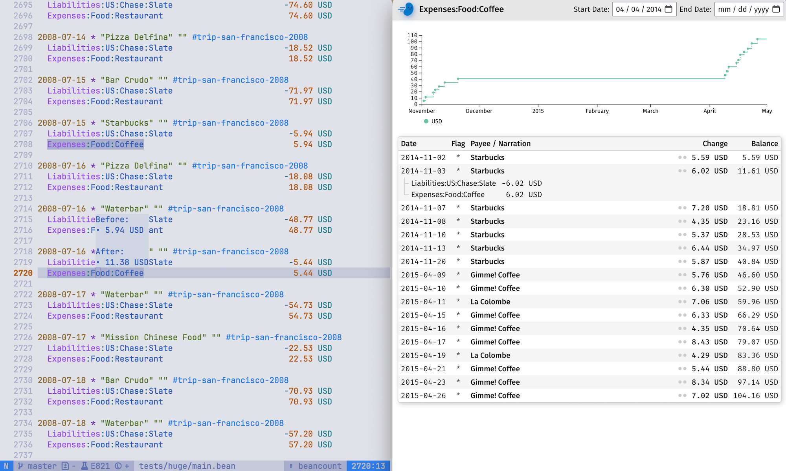

<p align="center">
  
</p>
<h2 align="center">TurboBean</h2>

An implementation of [Beancount](https://github.com/beancount/beancount) with a focus on speed and ease of use.



## Features

- [x] Speed (processes huge files instantly)
- [x] LSP Server
  - [x] Jump to account open
  - [x] Hover account (before + after balance)
  - [x] Auto completion (accounts, tags, links)
  - [x] Highlight account
  - [x] Syntax highlighting via semantic tokens
  - [x] Rename account
- [ ] Web Viewer
  - [ ] File Watcher (reloads instantly)
  - [x] Journal
  - [ ] Balance Sheet
  - [ ] Income Statement
- [ ] Lua Plugins
- [ ] Formatter
- [ ] Protobuf Output

#### Not Planned (for now)

- Query Language

## Compatibility

Mostly compatible with Beancount, but follows some ideas from [Beancount Vnext:
Goals
& Design](https://docs.google.com/document/d/1qPdNXaz5zuDQ8M9uoZFyyFis7hA0G55BEfhWhrVBsfc/edit?tab=t.0),
notably [Beancount - Vnext: Booking Rules
Redesign](https://docs.google.com/document/d/1H0UDD1cKenraIMe40PbdMgnqJdeqI6yKv0og51mXk-0/view#).
This is currently implemented in a non-backwards-compatible way.

## Todos

### Lexer

### Parser

- Validate accounts
- Number expressions
- KeyValue
  - Value = Amount
- Custom
- Commodity directive

### Renderer

### LSP

#### Highlight

- Tags
- Links

#### Sem Tokens

- Range

### Beancount


### UI

- Display more while there are still errors

### Bugs

- Balancing algo doesn't see ambiguity (only substitutes EUR):
    Foo   1 EUR @
    Bar
- Segfault when two sse connections and watch triggers

## Editor Setup

### neovim

Put this into your nvim-lspconfig's `config` function:

```lua
    local lspconfig = require 'lspconfig'
    require('lspconfig.configs').turbobean = {
      default_config = {
        cmd = {
          'bash',
          '-c',
          '/Users/moritz/code/turbobean/zig-out/bin/turbobean lsp 2> >(tee turbobean.log >&2)',
        },
        filetypes = { 'beancount', 'bean' },
        root_dir = require('lspconfig.util').root_pattern 'turbobean.config',
      },
    }
    lspconfig.turbobean.setup {}

```

Disable treesitter:

```lua
return {
  'nvim-treesitter/nvim-treesitter',
  opts = {
    highlight = {
      enable = true,
      disable = { 'beancount' },
    },
  },
}
```

### VSCode

Use extension in this repo.

```bash
cd vscode
npm i
code .
```

Then press `F5`, or go to debugging and click "Run Extension".

#### Testing

```bash
npm i
npm run test
```

## Scratch

### Pipeline

File:
- Balance (tx level)

Project:
- Sort (project level)
- Check:
  - Accounts properly opened/not closed (project level)
  - Insert pads (project level)
  - Can only post to currencies defined at account open (project level)
  - Booking rules followed

Process:
- Insert PnL postings (project level)

Query:
- Inventory until posting
